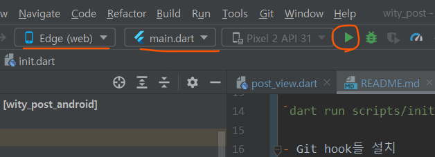

# witypost

- 유용한 글들 모아서 링크랑 추가 정보 보여주는 간단한 웹사이트
  - 플러터 웹 기반

## 개발 전 설치

- [Git](https://git-scm.com/)
- [Flutter SDK](https://flutter.dev/)
- 안드로이드 스튜디오
  - 개발 시 추천

## 개발 전 수행

- `dart run scripts/init.dart`를 실행해주세요. 해당 스크립트는 아래의 명령들을 차례로 실행합니다.
  - [Git hook](https://velog.io/@tjdgus0528/Git-hooks-%EC%9D%B4%EB%9E%80-Husky-lint-staged)들 설치: `git config --local core.hooksPath hooks`
  - 의존성 설치: `flutter pub get`

## 개발 시 실행

- 안드로이드 스튜디오에서 `(web)`이라 들어간 것중 하나 고르고 재생 버튼 누르거나  
  
- 터미널에서 `flutter run -d chrome` 실행

## 글 추가

- **input.yaml**에 글의 정보를 추가하고 `dart run scripts/update.dart`를 실행해주세요.
  - 이미지들이 "assets/post_images"에 다운로드되며, "lib/common/posts.dart"가 생성됩니다.
- 그 후 커밋을 올려주면 됩니다.

## 배포하기

- 현재는 구글 파이어베이스(Firebase)를 사용합니다. main 브랜치에 커밋이 추가될때마다 자동으로 배포가 됩니다.
  - 어느 정도 작업을 할 때마다 pubspec.yaml에서 **version을 올려주시길** 권장합니다. 그렇지 않으면 브라우저가 캐싱해놓은 이전 버전을 대신 보여줄 수 있습니다.
- 수동 배포하려면 [링크](https://docs.flutter.dev/deployment/web#deploying-to-firebase-hosting)를 참고하여 파이어베이스 도구를 설치하고, `flutter clean && firebase deploy`를 실행하세요.
  - 플러터 버그로 빌드할 때 가끔 필수 파일이 사라지는 경우가 있는데, `flutter clean`은 그것을 방지해줍니다.

## 폴더 구조

```text
lib
+- common: 상수, 유틸 등 공통 코드
+- providers: 여러 widget들이 사용하는 공통 상태들 관리
+- widgets: Widget들 (UI)
```
